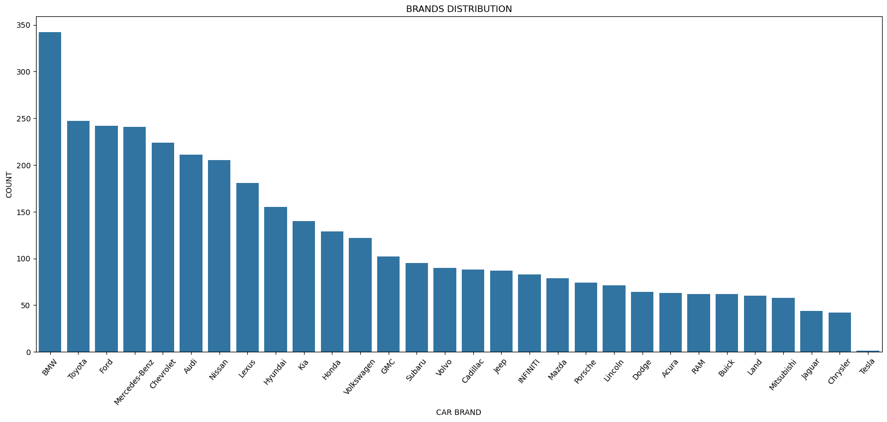
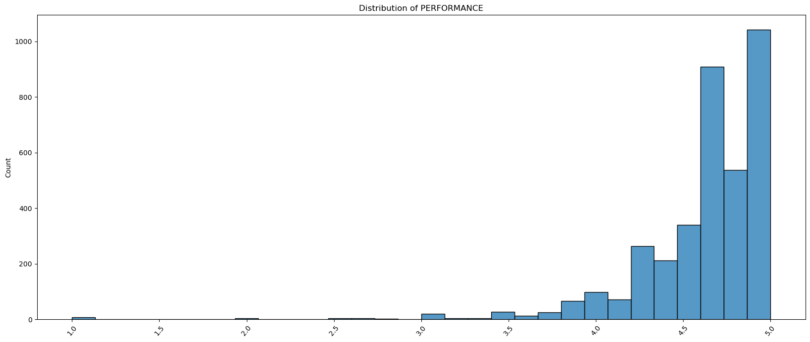
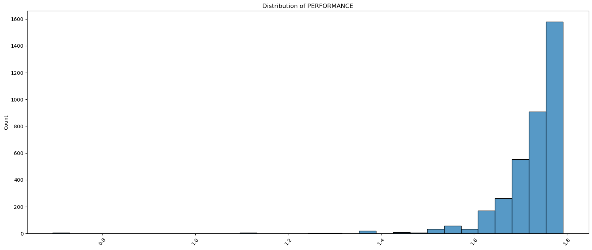
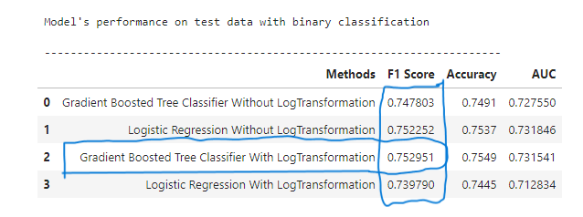
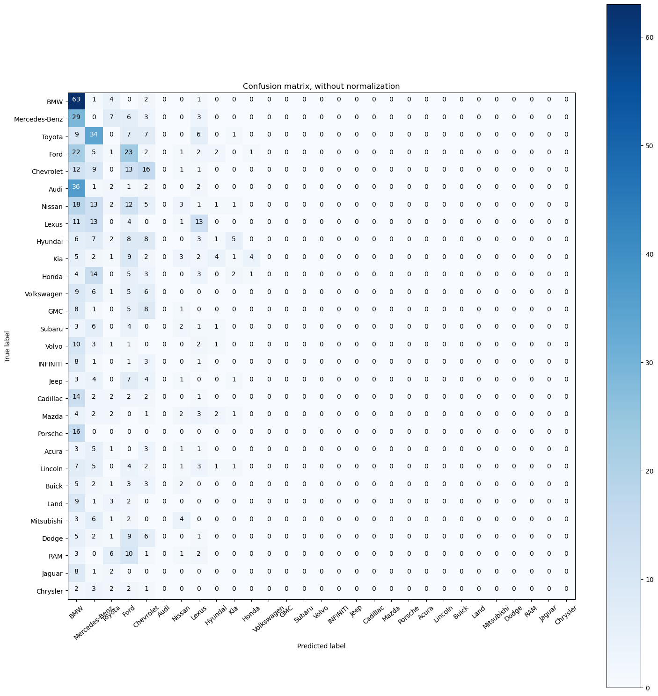

# Car Brand Classification

This project was completed as part of the CIT 650 "Intro To Big Data" course at Nile University.

# Objective:

  * Use Pyspark to practice various data analytics techniques such as data visualization, and classification tasks such as brand classification.
# Questions:

  *   Can we segment cars based on their customer feedback (brand classification)?
# Dataset:
  * [On Kaggle](https://www.kaggle.com/datasets/ahmettalhabektas/new-york-cars-big-data-2023)
  * About the data:
    
This dataset comprises the car rates obtained from the cars.com website and encompasses seven distinct categories of car ratings
    
    General Rate
    Comfort
    Interior Design
    Performance
    Value For The Money
    Exterior Styling
    Reliabilityability)
    
* The data has 4243 rows and 12 columns.
================================================================================================================================================================
# Summary Of Findings

### 1-Exploratory Data Analysis

#### **Findings:

* We have imbalanced data; our Y Label "car Brands" contains 29 brands, and their frequency varies from each other.

* Rating variables are highly skewed, with outliers, because of that, we have applied logarithmic transformation on those variables so the tremendous and minimal values do not negatively affect the performance of a learning algorithm. Using a logarithmic transformation significantly reduces the range of values caused by outliers.

Skewed variable before transformation

Skewed variable after transformation

* We have dropped highly correlated variables to avoid multicollinearity and reduce dimensionality.

### 2- Data Modeling

#### A. We have modeled the data, as multiclass classification, with Random Forest and Logistic Regression because they are more robust on multiclass tasks with imbalanced classes, and can handle skewness in the data. 
   
##### Model's Metrcies:
* We focused on the Area Under The Curve score because it gives info about the overall discrimination of the model, especially when dealing with imbalanced datasets.

#### B. We have modeled the data, as binary classification [Luxury Brands, Non Luxury Brands], with a Gradient Boosted Tree Classifier and Logistic Regression. Here we focused on the F1 score, even though the models perform better in binary classification than multiclass, we have lost information about brands as individuals.

# Conclustion:
* As we have imbalanced data, and rating variables have outliers, the performance of the models wasn't good enough to classify brands, especially on multiclass. As we can see from the confusion matrix graph the Random Forest is biased toward the most frequent brands than other brands.

# Further Steps to enhance model performance:
* Getting more data.
* Hyperparameter Tuning.
* Trying another transformation/technique to handle outliers and data balancing.
